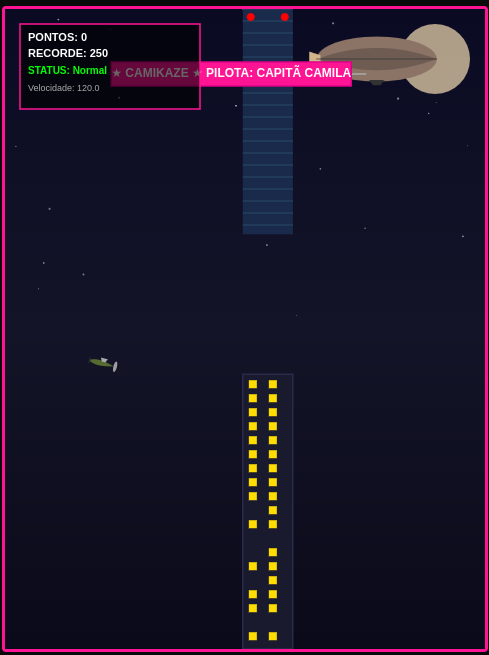

# CAMIKAZE: O Voo da Capitã Camila ✈️️

> **Builders League Edition** — Uma evolução e customização completa do projeto base **Flappy Kiro**.

Um jogo retrô de navegação contínua no navegador, desenvolvido em HTML5, Vanilla JavaScript e Canvas API. Pilote a Capitã Camila desviando de arranha-céus, coletando estrelas e ativando power-ups em um cenário noturno dinâmico!



## 🚀 Live Demo

👉 **[Jogar CAMIKAZE no GitHub Pages](https://camialmeidas.github.io/camikaze-flappy-game/)**

---

## 🎮 Como Jogar

1. Abra o arquivo `index.html` em qualquer navegador (ou sirva localmente com `python3 -m http.server 8000`).
2. Escolha a sua aeronave na tela inicial de seleção.
3. Clique ou pressione **Espaço** para iniciar e dar impulso/voar.
4. Navegue pelos espaços livres entre os prédios para pontuar.
5. Colete estrelas douradas e power-ups para acumular pontos e obter habilidades especiais!

---

## ⌨️ Controles

| Entrada | Ação |
|---|---|
| **Espaço / Clique / Toque** | Selecionar aeronave / Dar impulso / Reiniciar |

---

## ✨ Recursos & Melhorias (Camikaze)

- **Seleção de 3 Aeronaves Vetoriais (SVG)**:
  - 🛩️ **Vintage Militar**: Monoplano esportivo verde-oliva.
  - ✈️ **Caça Supersônico**: Jato moderno em tons de azul e ciano.
  - 🚁 **Heli-Patrulha**: Helicóptero em ciano neon de alto contraste para visibilidade noturna.
- **Zeppelin com Banner Publicitário**: Dirigível clássico navegando pelo fundo do céu noturno, puxando uma faixa rosa estilizada: *"★ CAMIKAZE ★ PILOTA: CAPITÃ CAMILA"*.
- **Progressão Dinâmica de Velocidade**: O jogo aumenta suavemente a velocidade de rolagem dos prédios a cada 10 pontos acumulados!
- **Sistema de Áudio via Web Audio API**: Som de derrota estilo *arcade* (glissando descendente de "whomp-whomp") sintetizado sem arquivos externos.
- **Power-ups & Efeitos Visuais**:
  - 🌟 **Estrelas Douradas**: Pontuação extra com explosão de partículas brilhantes ao coletar.
  - 🥊 **Punho Destruidor**: Proteção temporária contra obstáculos.
  - 🧲 **Ímã**: Atração automática de estrelas próximas.
- **Painel HUD Translúcido**: Exibição limpa de Pontos, Recorde Pessoal e Status de Power-up ativo no canto superior.
- **Física & Animação**: Rotação dinâmica do avião conforme a velocidade vertical e colisão imediata com prédios e chão.

---

## 🏗️ Arquitetura & Motor (Baseado em Flappy Kiro)

### Máquina de Estados

```mermaid
stateDiagram-v2
    [*] --> Start
    Start --> Playing : Espaço / Clique / Toque
    Playing --> GameOver : Colisão (Chão/Prédios)
    GameOver --> Playing : Espaço / Clique / Toque